<div align="center">

  <!-- dynamic typing effect 动态字符效果 -->
  <div>
      
  </div>

  <!-- knock code pictures 程序媛敲代码的图片 -->
  <picture>
    <source media="(prefers-color-scheme: dark)" srcset="./assets/images/839536.svg" />
    <source media="(prefers-color-scheme: light)" srcset="./assets/images/839536.svg" />
    
  </picture>

  <div>&nbsp;</div>

  <!-- Snake Code Contribution Map 贪吃蛇代码贡献图 -->
  <picture>
    <source media="(prefers-color-scheme: dark)" srcset="./assets/grid-snake/grid-snake-dark.svg" />
    <source media="(prefers-color-scheme: light)" srcset="./assets/grid-snake/grid-snake.svg" />
    
  </picture>

</div>

# 🙋 Hello

<table>

<tr><td>

### 🤺 About Me

<p>&emsp;&emsp;嗨，你好，我是Kimi同学。热爱编程、摄影、读书、旅行。</p>
<p>&emsp;&emsp;热爱计算机科学和 互联网事业，希望能成为一名优秀的开发者。</p>
<p>&emsp;&emsp;我们正在让这个世界变得更加美好，通过代码的重复使用和延展构建完美体系。</p>
<p>&emsp;&emsp;<strong>We're making the world a better place. Through constructing elegant hierarchies for maximum code reuse and extensibility.</strong></p>

</td></tr>

<tr><td>

### 📊 WakaTime

<picture>
  <source
    srcset="https://github-readme-stats.vercel.app/api/wakatime?username=839128&layout=compact&text_color=f0f6fc&bg_color=00000000&hide_border=true&hide_title=true"
    media="(prefers-color-scheme: dark)"
  />
  <source
    srcset="https://github-readme-stats.vercel.app/api/wakatime?username=839128&layout=compact&text_color=1f2328&bg_color=00000000&hide_border=true&hide_title=true"
    media="(prefers-color-scheme: light)"
  />
  
</picture>

</td></tr>

<tr><td>

<!--START_SECTION:waka-->
**I'm an Early 🐤**

```text
🌞 Morning                1528 commits        ███████░░░░░░░░░░░░░░░░░░   27.44 % 
🌆 Daytime                2593 commits        ████████████░░░░░░░░░░░░░   46.56 % 
🌃 Evening                1380 commits        ██████░░░░░░░░░░░░░░░░░░░   24.78 % 
🌙 Night                  68 commits          ░░░░░░░░░░░░░░░░░░░░░░░░░   01.22 % 
```

📅 **I'm Most Productive on Monday**

```text
Monday                   1096 commits        █████░░░░░░░░░░░░░░░░░░░░   19.68 % 
Tuesday                  1079 commits        █████░░░░░░░░░░░░░░░░░░░░   19.38 % 
Wednesday                698 commits         ███░░░░░░░░░░░░░░░░░░░░░░   12.53 % 
Thursday                 869 commits         ████░░░░░░░░░░░░░░░░░░░░░   15.60 % 
Friday                   692 commits         ███░░░░░░░░░░░░░░░░░░░░░░   12.43 % 
Saturday                 450 commits         ██░░░░░░░░░░░░░░░░░░░░░░░   08.08 % 
Sunday                   685 commits         ███░░░░░░░░░░░░░░░░░░░░░░   12.30 % 
```

📊 **This Week I Spent My Time On**

```text
🕑︎ Time Zone: Asia/Shanghai

💬 Programming Languages: 
No Activity Tracked This Week

🔥 Editors: 
No Activity Tracked This Week

💻 Operating System: 
No Activity Tracked This Week
```

Last Updated on 07/10/2024 10:40:07 UTC
<!--END_SECTION:waka-->

</td></tr>

</table>


<!-- ########################################## 分割 ########################################## -->


<div align="center">

<!-- metrics 基础资料 -->
<!-- GitHub Activity Graph GitHub 活动图 -->
<table>
  <tr>
    <td>
      <picture>
        <source media="(prefers-color-scheme: dark)" srcset="https://github-readme-activity-graph.vercel.app/graph?username=839128&theme=xcode&bg_color=FF000000&hide_border=true" />
        <source media="(prefers-color-scheme: light)" srcset="https://github-readme-activity-graph.vercel.app/graph?username=839128&theme=xcode&bg_color=FF000000&color=000000&hide_border=true" />
        
      </picture>
  </tr>
</table>

</div>

<!-- ########################################## 分割 ########################################## -->


<div align="center" >

<!-- GitHub 奖杯🏆 -->
<div><br/></div>

<!-- GitHub 数据统计 -->

<br>

<!-- Wakatime Graph-->
<table>
  <tr>
    <td></td>
    <td></td>
  </tr>
</table>

</div>

<!-- ########################################## 分割 ########################################## -->


<div align="center" >

<!-- svg -->


 


<br>

<!-- gif -->


<!-- profile-3d-contrib 3D 贡献图-->
<picture>
  <source media="(prefers-color-scheme: dark)"  srcset="./assets/profile-3d/profile-night-rainbow.svg" />
  <source media="(prefers-color-scheme: light)" srcset="./assets/profile-3d/profile-gitblock.svg" />
  
</picture>

</div>

<!-- ########################################## 分割 ########################################## -->


<!-- GitHub metrics 信息指标 -->
<div align="center">

<!-- first form 第一个表格 -->
<table>
  <tr>
    <td></td>
    <td></td>
  </tr>
  <tr>
    <td></td>
    <td></td>
  </tr>
  <tr>
    <td></td>
    <td></td>
  </tr>
  <tr>
    <td></td>
    <td></td>
  </tr>
  <tr>
    <td></td>
    <td></td>
  </tr>
  <tr>
    <td></td>
    <td></td>
  </tr>
</table>


<!-- just img 图片 -->
</div>
</div>