<div align="center">

  <!-- dynamic typing effect 动态字符效果 -->
  <div>
      
  </div>

  <!-- knock code pictures 程序媛敲代码的图片 -->
  <picture>
    <source media="(prefers-color-scheme: dark)" srcset="./assets/images/839536.svg" />
    <source media="(prefers-color-scheme: light)" srcset="./assets/images/839536.svg" />
    
  </picture>

  <div>&nbsp;</div>


  <!-- Snake Code Contribution Map 贪吃蛇代码贡献图 -->
  <picture>
    <source media="(prefers-color-scheme: dark)" srcset="./assets/grid-snake/grid-snake-dark.svg" />
    <source media="(prefers-color-scheme: light)" srcset="./assets/grid-snake/grid-snake.svg" />
    
  </picture>

</div>

# 🙋 Hello

<table>

<tr><td>

### 🤺 About Me

<p>&emsp;&emsp;嗨，你好，我是Kimi同学。热爱编程、摄影、读书、旅行。</p>
<p>&emsp;&emsp;热爱计算机科学和 互联网事业，希望能成为一名优秀的开发者。</p>
<p>&emsp;&emsp;我们正在让这个世界变得更加美好，通过代码的重复使用和延展构建完美体系。</p>
<p>&emsp;&emsp;<strong>We're making the world a better place. Through constructing elegant hierarchies for maximum code reuse and extensibility.</strong></p>

</td></tr>

<tr><td>

### 📊 WakaTime

<picture>
  <source
    srcset="https://github-readme-stats.vercel.app/api/wakatime?username=839128&layout=compact&text_color=f0f6fc&bg_color=00000000&hide_border=true&hide_title=true"
    media="(prefers-color-scheme: dark)"
  />
  <source
    srcset="https://github-readme-stats.vercel.app/api/wakatime?username=839128&layout=compact&text_color=1f2328&bg_color=00000000&hide_border=true&hide_title=true"
    media="(prefers-color-scheme: light)"
  />
  
</picture>

</td></tr>

<tr><td>

<!--START_SECTION:waka-->
**I'm an Early 🐤** 

```text
🌞 Morning                10 commits          ████░░░░░░░░░░░░░░░░░░░░░   15.15 % 
🌆 Daytime                26 commits          ██████████░░░░░░░░░░░░░░░   39.39 % 
🌃 Evening                26 commits          ██████████░░░░░░░░░░░░░░░   39.39 % 
🌙 Night                  4 commits           ██░░░░░░░░░░░░░░░░░░░░░░░   06.06 % 
```
📅 **I'm Most Productive on Monday** 

```text
Monday                   24 commits          █████████░░░░░░░░░░░░░░░░   36.36 % 
Tuesday                  3 commits           █░░░░░░░░░░░░░░░░░░░░░░░░   04.55 % 
Wednesday                0 commits           ░░░░░░░░░░░░░░░░░░░░░░░░░   00.00 % 
Thursday                 3 commits           █░░░░░░░░░░░░░░░░░░░░░░░░   04.55 % 
Friday                   7 commits           ███░░░░░░░░░░░░░░░░░░░░░░   10.61 % 
Saturday                 8 commits           ███░░░░░░░░░░░░░░░░░░░░░░   12.12 % 
Sunday                   21 commits          ████████░░░░░░░░░░░░░░░░░   31.82 % 
```


📊 **This Week I Spent My Time On** 

```text
🕑︎ Time Zone: Asia/Shanghai

💬 Programming Languages: 
Java                     2 hrs 11 mins       ████████████████████░░░░░   79.23 % 
XML                      17 mins             ███░░░░░░░░░░░░░░░░░░░░░░   10.73 % 
YAML                     9 mins              █░░░░░░░░░░░░░░░░░░░░░░░░   05.79 % 
Markdown                 6 mins              █░░░░░░░░░░░░░░░░░░░░░░░░   03.73 % 
XSLT                     0 secs              ░░░░░░░░░░░░░░░░░░░░░░░░░   00.29 % 

🔥 Editors: 
IntelliJ IDEA            2 hrs 45 mins       █████████████████████████   100.00 % 

💻 Operating System: 
Mac                      2 hrs 45 mins       █████████████████████████   100.00 % 
```


 Last Updated on 30/05/2025 13:55:59 UTC
<!--END_SECTION:waka-->

</td></tr>

</table>


<!-- ########################################## 分割 ########################################## -->


<div align="center">

<!-- metrics 基础资料 -->
<!-- GitHub Activity Graph GitHub 活动图 -->
<table>
  <tr>
    <td>
      <picture>
        <source media="(prefers-color-scheme: dark)" srcset="https://github-readme-activity-graph.vercel.app/graph?username=839128&theme=xcode&bg_color=FF000000&hide_border=true" />
        <source media="(prefers-color-scheme: light)" srcset="https://github-readme-activity-graph.vercel.app/graph?username=839128&theme=xcode&bg_color=FF000000&color=000000&hide_border=true" />
        
      </picture>
  </tr>
</table>

</div>

<!-- ########################################## 分割 ########################################## -->


<div align="center" >

<!-- GitHub 奖杯🏆 -->
<div><br/></div>

<!-- GitHub 数据统计 -->

<br>

<!-- Wakatime Graph-->
<table>
  <tr>
    <td></td>
    <td></td>
  </tr>
</table>

</div>

<!-- ########################################## 分割 ########################################## -->


<div align="center" >

<!-- profile-3d-contrib 3D 贡献图-->
<picture>
  <source media="(prefers-color-scheme: dark)"  srcset="./assets/profile-3d/profile-night-rainbow.svg" />
  <source media="(prefers-color-scheme: light)" srcset="./assets/profile-3d/profile-gitblock.svg" />
  
</picture>

</div>

<!-- ########################################## 分割 ########################################## -->


<!-- GitHub metrics 信息指标 -->
<div align="center">

<!-- first form 第一个表格 -->
<table>
  <tr>
    <td></td>
    <td></td>
  </tr>
  <tr>
    <td></td>
    <td></td>
  </tr>
  <tr>
    <td></td>
    <td></td>
  </tr>
  <tr>
    <td></td>
    <td></td>
  </tr>
  <tr>
    <td></td>
    <td></td>
  </tr>
  <tr>
    <td></td>
    <td></td>
  </tr>
</table>


<!-- just img 图片 -->
</div>
</div>